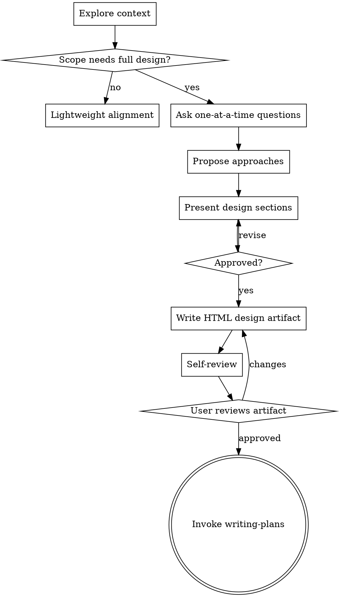

# Brainstorming Ideas Into Designs

Use this skill to turn a rough idea into an approved design before
implementation. It is for meaningful design uncertainty, not every small edit.

<DESIGN-GATE>
For full brainstorming, do not invoke implementation skills, write code,
scaffold a project, or take implementation action until you have presented the
design and the human partner has approved it.
</DESIGN-GATE>

## When To Use

Use full brainstorming when the request involves:

- New product behavior, user experience, workflow, or architecture
- Multiple reasonable approaches with real tradeoffs
- Ambiguous success criteria or business rules
- Multiple subsystems that may need decomposition
- Security, public API/schema/persisted-data, dependency, or destructive decisions
- Explicit "brainstorm", "design", "spec", or "help me think this through"

Do not use full brainstorming for:

- Simple questions, command output, file lookup, or code explanation
- Small well-scoped edits with clear acceptance criteria
- Existing approved specs that only need a plan
- Bug symptoms that need root-cause investigation first

## Lightweight Alignment

If the work is bounded but a little under-specified, do lightweight alignment
instead of the full process:

1. Inspect available project context before asking.
2. State the change, constraints, and success check in a few lines.
3. Ask at most one blocking question if a wrong assumption would be expensive.
4. Include your recommended answer when asking.
5. Proceed when the path is clear.

No design artifact is required for lightweight alignment unless the human
partner asks for one or the discussion uncovers larger design uncertainty.

## Checklist

For full brainstorming, track and complete these items in order:

1. **Explore project context** - check files, docs, recent commits, and existing patterns
2. **Assess scope** - decompose first if the idea spans independent subsystems
3. **Ask clarifying questions** - one at a time, preferring options plus a recommendation
4. **Propose 2-3 approaches** - explain tradeoffs and your recommended path
5. **Present design** - validate sections scaled to their complexity
6. **Write design artifact** - save primary human-readable design as HTML
7. **Self-review** - fix placeholders, contradictions, ambiguity, and scope creep
8. **User review** - ask the human partner to review the written artifact
9. **Transition** - invoke writing-plans after approval

## Process Flow

The terminal state for full brainstorming is invoking writing-plans. Do not
invoke implementation skills directly from brainstorming.

## The Process

**Understand the idea**

- Read the current project structure before proposing changes.
- If the idea is too broad for one spec, decompose it into independently
  shippable sub-projects and brainstorm the first one.
- Ask one question per message. If you need more, continue the loop.
- Focus on purpose, constraints, success criteria, and decisions that cannot be
  inferred from the repo.

**Explore approaches**

- Offer 2-3 approaches.
- Lead with your recommended approach and explain why.
- Keep YAGNI pressure active: remove optional scope that does not support the
  stated goal.

**Present the design**

- Present design in readable sections: goal, non-goals, architecture,
  components, data flow, errors, testing, rollout, and open decisions.
- Keep each section as short as the decision allows. If a section is nuanced,
  stop after it and ask whether it looks right so far.

## HTML Design Artifact

For an approved full design, copy [design-template.html](design-template.html) to
`docs/superpowers/specs/YYYY-MM-DD-<topic>-design.html` and fill every section.
The HTML file is the source of truth for new designs. Existing `.md` specs stay
valid; do not convert them. A project convention or explicit human preference
may select Markdown instead.

## Self-Review

After writing the artifact, review it yourself:

1. **Placeholder scan:** no TBD, TODO, incomplete sections, or vague
   requirements
2. **Internal consistency:** architecture, requirements, and testing agree
3. **Scope check:** one implementation plan can cover it; otherwise decompose
4. **Ambiguity check:** any requirement with two plausible interpretations is
   made explicit

Fix issues inline before asking for review.

## User Review Gate

After the self-review passes, ask:

> Design artifact written to `<exact path>`. Please review it and tell me what
> to change before I write the implementation plan.

Wait for approval or requested changes. After approval, invoke writing-plans.

## Visual Companion

A browser-based companion can show mockups, diagrams, and visual options during
brainstorming. It is available as a tool, not a mode.

Offer it just-in-time only when a question would genuinely be clearer shown
than told. The offer must be its own message:

> This next part might be easier if I show you -- I can put together mockups,
> diagrams, and comparisons in a browser tab as we go. It's still new and can
> be token-intensive. Want me to? I'll open it for you.

Use the browser for visual questions: mockups, wireframes, layout comparisons,
architecture diagrams, and side-by-side visual designs. Use the terminal for
textual questions: requirements, tradeoffs, scope, and conceptual decisions.

If the human partner accepts, read `skills/brainstorming/visual-companion.md`
before proceeding.
