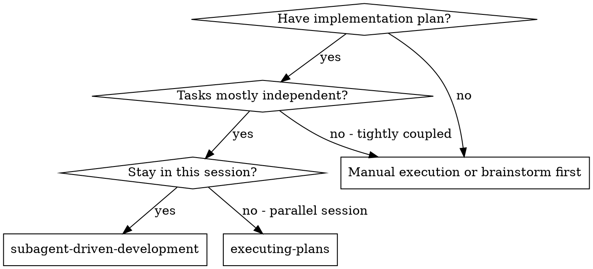
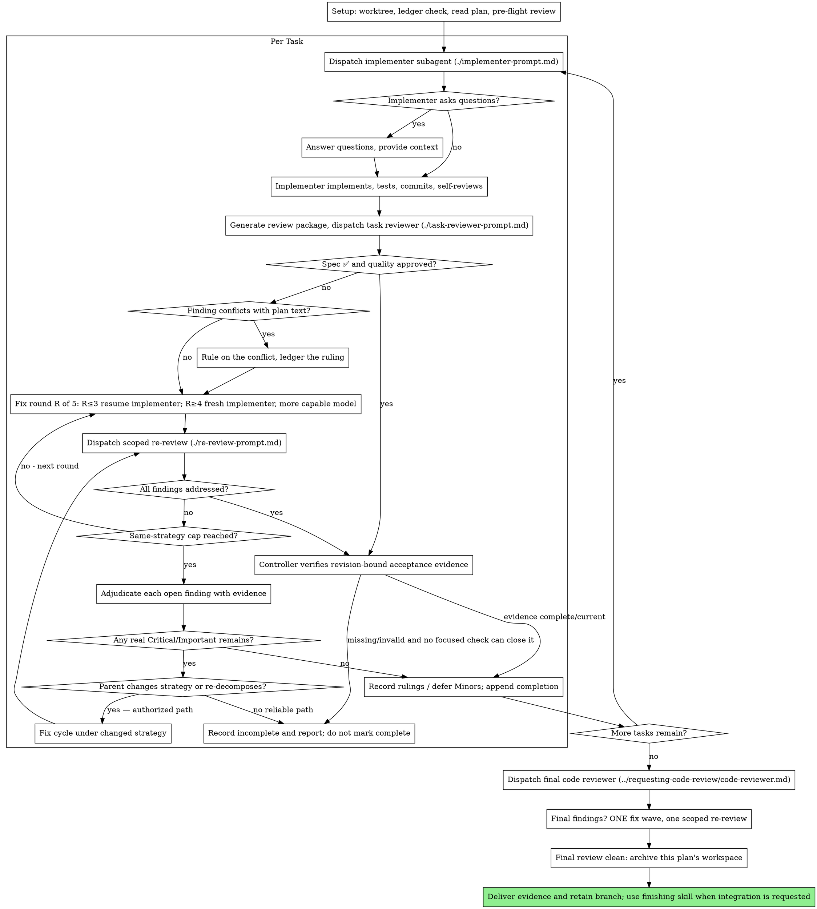

# Subagent-Driven Development

Execute plan by dispatching a fresh implementer subagent per task, a task review (spec compliance + code quality) after each, and a broad whole-branch review at the end.

**Why subagents:** You delegate tasks to specialized agents with isolated context. By precisely crafting their instructions and context, you ensure they stay focused and succeed at their task. They should never inherit your session's context or history — you construct exactly what they need. This also preserves your own context for coordination work.

**Core principle:** Fresh subagent per task + task review (spec + quality) + broad final review = high quality, fast iteration

Completion requires both a clean review state and verified acceptance evidence.
A Critical or Important acceptance gap remains blocking until it is fixed or
the controller records evidence that disproves the finding. A retry cap limits
repeating one fix strategy; it is not a correctness waiver.

**Narration:** between tool calls, narrate at most one short line — the
ledger and the tool results carry the record.

**Continuous execution:** Do not pause to check in with your human partner between tasks. Execute all tasks from the plan without stopping. The only reasons to stop are the four named below, or all tasks complete. "Should I continue?" prompts and progress summaries waste their time — they asked you to execute the plan, so execute it.

**Rulings, not stalls.** A running plan does not wait on a human. Conflicts,
ambiguities, plan defects, a cap you would have asked to exceed — decide
them. The spec is the binding authority, the plan is its argument, and your
judgment settles what neither answers. Record every decision in the ledger as
`Ruling: <what you decided> — <why> — <what it costs if wrong>`, and keep
going. A wrong ruling costs rework your human partner can see and undo; a
session parked on a question costs their whole day and buys nothing.

Four things stop you, and only these: an as-yet unauthorized irreversible or
destructive operation; a security-sensitive action; a cross-workspace external
side effect (merge, push, publish, or platform upload) that needs approval; and
a plan so broken that every path forward is a guess. Existing authorization
within the same scope persists. For a missing authorization or a broken plan,
stop and ask — via the brainstorming §1 Grill protocol — at most 3 blocking
questions, each with a recommended answer and an acceptance signal; resolve
what the codebase can answer before asking. A stop that rambles or
interrogates
buys nothing over a stop that offers answers to confirm.

## When to Use



**vs. Executing Plans (parallel session):**
- Same session (no context switch)
- Fresh subagent per task (no context pollution)
- Review after each task (spec compliance + code quality), broad review at the end
- Faster iteration (no human-in-loop between tasks)

## The Process



## Setup

Ensure the work happens in an isolated workspace: use
superpowers:using-git-worktrees to create one or verify the existing one.
In plan-execution mode, isolation is a ruling, not a question — plan or goal
approval already granted it, so do not stop to ask for worktree consent.
Never start implementation on a main/master branch without your human
partner's explicit consent.

Conversation memory does not survive compaction. In real sessions,
controllers that lost their place have re-dispatched entire completed task
sequences — the single most expensive failure observed. Track progress in
a ledger file, not only in todos.

- Each plan owns a workspace: at skill start, run this skill's
  `scripts/sdd-workspace PLAN_FILE` — it prints the plan's git-ignored
  directory (`<repo-root>/.superpowers/sdd/<plan-basename>/`), home to
  every artifact for THIS plan: ledger, briefs, reports, review packages.
  Another plan's directory is never yours to read or write.
- Check for this plan's ledger at `<workspace>/progress.md`. If its first
  line names your plan file, tasks with a `Task <N>: complete` line are DONE
  — do not re-dispatch them; resume at the first task without one. A task
  whose last line is a fix round is mid-loop: resume the loop at the next
  round. A ledger whose first line names a different plan file — or a stray
  ledger at the old flat path `.superpowers/sdd/progress.md` — is another
  plan's progress: leave it in place and start your own, fresh.
- Create the ledger with its identity as the first line:
  `# SDD ledger — plan: <plan file path>`.
- The ledger is your recovery map: the commits it names exist in git even
  when your context no longer remembers creating them. After compaction,
  trust the ledger and `git log` over your own recollection.
- `git clean -fdx` will destroy the workspace (it's git-ignored scratch); if
  that happens, recover from `git log`.

Read the plan once, note its context and Global Constraints, and create a
todo per task. If the plan names a Spec, read that too: the spec is the
authority the plan argues from, and conflicts inside the plan resolve
against it. A plan with no reachable spec gets a ledger note saying so —
rulings made without one are provisional.

Before dispatching Task 1, inspect the plan's self-review record and its
plan/spec/repository inputs. Reuse coverage and interface checks whose inputs
are unchanged; record the source in this plan's ledger. Inspect changed or
unreviewed requirements, unresolved items and critical producer/consumer seams.
If no usable record exists, perform the coverage and interface check once.

Record concrete conflicts and their Rulings, with affected tasks and evidence.
For a clean check, retain the checked scope and input revision in a short ledger
entry; a row for every task or task pair is unnecessary. Resolve conflicts
against the spec before dependent dispatch. Independent task review and final
review still inspect implementation and catch conflicts that emerge there.

## Model Selection

Use the least powerful model that can handle each role to conserve cost and increase speed.

On this fork, resolve abstract roles to concrete model/effort routing via your harness's routing reference (`references/*-tools.md`; Codex routes capability-aware across deepseek/qwen/GPT, Kimi Code exposes no model field so routing is omitted); routing must not change the serial implement-review-fix lifecycle.

**Mechanical implementation tasks** (isolated functions, clear specs, 1-2 files): use a fast, cheap model. Most implementation tasks are mechanical when the plan is well-specified.

**Integration and judgment tasks** (multi-file coordination, pattern matching, debugging): use a standard model.

**Architecture and design tasks**: use the most capable available model.
The final whole-branch review is one of these — dispatch it on the most
capable available model, not the session default.

**Review tasks**: choose the model with the same judgment, scaled to the
diff's size, complexity, and risk. A small mechanical diff does not need the
most capable model; a subtle concurrency change does. Scoped re-reviews of
small fix diffs take a cheap-to-mid tier.

**Fix-loop escalation (rounds 4-5)**: use a model at least one tier above
the implementer that got stuck.

**Specify the model explicitly only when your harness's dispatch schema
exposes a model field.** An omitted model inherits your session's model —
often the most capable and most expensive — which silently defeats this
section; but never require a field the active schema lacks (see
`references/*-tools.md` for schema-aware routing).

**Turn count beats token price.** Wall-clock and context cost scale with how
many turns a subagent takes, and the cheapest models routinely take 2-3× the
turns on multi-step work — costing more overall. Use a mid-tier model as the
floor for reviewers and for implementers working from prose descriptions.
When the task's plan text contains the complete code to write, the
implementation is transcription plus testing: use the cheapest tier for
that implementer. Single-file mechanical fixes also take the cheapest tier.

**Task complexity signals (implementation tasks):**
- Touches 1-2 files with a complete spec → cheap model
- Touches multiple files with integration concerns → standard model
- Requires design judgment or broad codebase understanding → most capable model

## The Task Loop

**Batch small same-shape work.** When the plan lists several tasks that are
each a small, independent edit of the same kind — the same one-line fix,
constant change, or field addition repeated across files — do not dispatch
one subagent per task. Compose ONE dispatch brief listing every file and
its change, send the whole batch to a single subagent, and review its diff
as one unit. Reserve one-dispatch-per-task for work that needs its own
judgment, its own tests, or its own review surface.

Everything you paste into a dispatch prompt — and everything a subagent
prints back — stays resident in your context for the rest of the session
and is re-read on every later turn. Hand artifacts over as files.

**Waiting on dispatched subagents:** never poll a wait interface with
short timeouts, and never sit in one silent, open-ended wait either.
While you have local work — ledger updates, packaging the next review,
reading reports — keep working; child results arrive on their own.
When you are genuinely idle, wait in bounded stretches (five to ten
minutes, where your platform allows), and between stretches post one
line of status and reconcile your live children: list them, and chase
any that finished without reporting. A bounded stretch keeps nearly
all of a long wait's efficiency while guaranteeing a stuck or lost
child is noticed within minutes, not at the end of the session.

### 1. Dispatch the implementer

Record BASE (`git rev-parse HEAD`) before dispatching — the review package
and fix-round diffs need it.

- **Task brief:** before dispatching an implementer, run this skill's
  `scripts/task-brief PLAN_FILE N` — it extracts the task's full text to a
  uniquely named file and prints the path. Compose the dispatch so the
  brief stays the single source of
  requirements. Your dispatch should contain: (1) one line on where this
  task fits in the project; (2) the brief path, introduced as "read this
  first — it is your requirements, with the exact values to use verbatim";
  (3) interfaces and decisions from earlier tasks that the brief cannot
  know; (4) your resolution of any ambiguity you noticed in the brief;
  (5) the report-file path and report contract; (6) the acceptance evidence
  — the exact command(s) that prove the task done and the expected output,
  copied from the brief's verification steps, so "done" is never guessed. Exact values (numbers,
  magic strings, signatures, test cases) appear only in the brief. Never
  make a subagent read the whole plan file.
- **Report file:** name the implementer's report file after the brief
  (brief `…/task-N-brief.md` → report `…/task-N-report.md`) and put it in
  the dispatch prompt. The implementer writes the full report there and
  returns only status, commits, a one-line test summary, and concerns.
- A dispatch prompt describes one task, not the session's history. Do not
  paste accumulated prior-task summaries ("state after Tasks 1-3") into
  later dispatches — a real session's dispatch hit 42k chars of which 99%
  was pasted history. A fresh subagent needs its task, the interfaces it
  touches, and the global constraints. Nothing else.
- The dispatch carries the no-subagents contract (it is in the
  implementer template): the implementer never dispatches subagents —
  not helpers, and never a reviewer. Review arrives from you, after the
  report. In real sessions, every reviewer a worker spawned duplicated
  the task review the controller dispatched anyway — a full extra
  review seat per task.
- If an earlier task deferred a Minor or recorded a finding-exclusion ruling
  in the area this task touches, carry a pointer to that ledger entry in the
  dispatch.
- Record the implementer's agent identity from the dispatch result —
  fix-loop rounds 1-3 resume this agent.
- Never dispatch implementation subagents in parallel. The implement-review-fix
  lifecycle is serial: the task review's diff range (`BASE..HEAD`) assumes one
  implementer's linear commits, and parallel implementers editing shared files
  interleave those commits. Read-only investigation and disjoint-file work are
  the parallel pattern's job (dispatching-parallel-agents), not this skill's.

Template: [implementer-prompt.md](implementer-prompt.md)

### 2. Handle the report

Implementer subagents report one of four statuses. Handle each appropriately:

**DONE:** Generate the review package (`scripts/review-package PLAN_FILE BASE HEAD`, from this skill's directory — it prints the unique file path it wrote; BASE is the commit you recorded before dispatching the implementer — never `HEAD~1`, which silently drops all but the last commit of a multi-commit task), then dispatch the task reviewer with the printed path.

**DONE_WITH_CONCERNS:** The implementer completed the work but flagged doubts. Read the concerns before proceeding. If the concerns are about correctness or scope, address them before review. If they're observations (e.g., "this file is getting large"), note them and proceed to review.

**NEEDS_CONTEXT:** The implementer needs information that wasn't provided. Provide the missing context and re-dispatch.

**BLOCKED:** The implementer cannot complete the task. Assess the blocker:
1. If it's a context problem, provide more context and re-dispatch with the same model
2. If the task requires more reasoning, re-dispatch with a more capable model
3. If the task is too large, break it into smaller pieces
4. If the plan itself is wrong, rule on the correction, ledger it, and re-dispatch with the ruling carried in the dispatch

**Never** ignore an escalation or force the same model to retry without changes. If the implementer said it's stuck, something needs to change.

If the implementer asks questions — before starting or mid-task — answer
clearly and completely, provide additional context if needed, and don't
rush it into implementation.

Before accepting any DONE status, the controller owns the acceptance check.
Tie each claim to the exact revision under review, inspect the retained raw
command output and exit code, locate the produced artifact, and map the
evidence to the stated criterion. A short success summary is not evidence.
When the evidence is complete and still valid for the current workstate,
consume it without mechanically rerunning the whole suite. If it is missing,
stale, or raises a concrete question, run only the smallest focused check that
resolves that gap.

### 3. Review the task

Per-task reviews are task-scoped gates. The broad review happens once, at the
final whole-branch review. Never skip the task review, and never accept a
report missing either verdict — spec compliance AND task quality are both
required. Implementer self-review never replaces the task review; both are
needed.

- Hand the reviewer its diff as a file: run this skill's
  `scripts/review-package PLAN_FILE BASE HEAD` and pass the reviewer the file path
  it prints (or, without bash: `git log --oneline`, `git diff --stat`,
  and `git diff -U10` for the range, redirected to one uniquely named
  file). The output never enters your own context, and the reviewer sees
  the commit list, stat summary, and full diff with context in one Read
  call. Use the BASE you recorded before dispatching the implementer —
  never `HEAD~1`, which silently truncates multi-commit tasks. Never
  dispatch a task reviewer without a diff file.
- **Reviewer inputs:** the task reviewer gets three paths — the same brief
  file, the report file, and the review package — plus the global
  constraints that bind the task.
- The global-constraints block you hand the reviewer is its attention
  lens. Copy the binding requirements verbatim from the plan's Global
  Constraints section or the spec: exact values, exact formats, and the
  stated relationships between components ("same layout as X", "matches
  Y"). The reviewer's template already carries the process rules (YAGNI,
  test hygiene, review method) — the constraints block is for what THIS
  project's spec demands.
- Do not add open-ended directives like "check all uses" or "run race tests
  if useful" without a concrete, task-specific reason
- Do not ask a reviewer to re-run tests the implementer already ran on the
  same code — the implementer's report carries the test evidence
- Do not pre-judge findings for the reviewer — never instruct a reviewer to
  ignore or not flag a specific issue. If you believe a finding would be a
  false positive, let the reviewer raise it and adjudicate it in the review
  loop. If the prompt you are writing contains "do not flag," "don't treat X
  as a defect," "at most Minor," or "the plan chose" — stop: you are
  pre-judging, usually to spare yourself a review loop.
The task reviewer may report "⚠️ Cannot verify from diff" items — requirements
that live in unchanged code or span tasks. These do not block the rest of the
review, but you must resolve each one yourself before marking the task
complete: you hold the plan and cross-task context the reviewer
lacks. If you confirm an item is a real gap, treat it as a failed spec
review — it enters the fix loop with the other findings.

Template: [task-reviewer-prompt.md](task-reviewer-prompt.md)

### 4. The fix loop

The loop triggers when the review reports spec ❌, any Critical or Important
finding, or a ⚠️ item you confirmed as a real gap.

Before the loop starts, two routes leave it immediately:

- Record Minor findings in the progress ledger as you go
  (`Task <N>: minor (deferred): <one-liner>`), and point the final
  whole-branch review at that list so it can triage which must be fixed
  before merge. A roll-up nobody reads is a silent discard. Minor findings
  never enter the loop.
- A finding labeled plan-mandated — or any finding that conflicts with
  what the plan's text requires — is yours to rule on: weigh the finding
  against the plan text, decide with the spec as the binding authority, and
  ledger the ruling before you act on it. Do not dismiss the finding because
  the plan mandates it, and do not dispatch a fix that contradicts the plan
  without a recorded ruling.
Everything else enters the loop. A fix round is one fix dispatch plus one
scoped re-review. Five rounds maximum per task using the same fix strategy;
the cap limits repeated retries of that strategy and does not waive a real
Critical/Important acceptance gap.

**Rounds 1-3 — resume the original implementer.** Send it the open findings
verbatim. Its context is intact: it knows the task, the code, and its own
choices. If your harness cannot send another message to a live subagent,
dispatch a fresh implementer carrying the brief path, the report-file path,
and the findings — the report file is the persistent memory either way.

**Rounds 4-5 — dispatch a fresh implementer on a more capable model** (per
Model Selection), with the brief path, the report-file path, the open
findings, and this framing: "A prior implementer attempted this task
[N] times; you own it now. Read the report file for what was tried." A loop
that survives three resumes usually means the implementer cannot see its
own problem — fresh eyes and a capability bump in one move.

**Every round, either way:** the implementer fixes, re-runs the tests
covering the amended code, appends its fix report to the same report file,
and returns the short contract. Before re-dispatching the reviewer, confirm
the fix report contains the covering tests, the command run, and the
output; dispatch the re-review once all three are present. Name the
covering test files in the fix message — a one-line fix does not need the
whole suite.

**The re-review is scoped.** Run `scripts/review-package PLAN_FILE FIX_BASE HEAD`
where FIX_BASE is the head the previous review saw, and dispatch
[re-review-prompt.md](re-review-prompt.md) with the findings list, the
brief, the report file, and the printed diff path. The re-reviewer verdicts
each finding ADDRESSED or NOT ADDRESSED and flags new breakage in the fix
diff only. New Critical/Important breakage in the fix diff joins the open
findings list. Out-of-scope observations go to the ledger as deferred
minors — they never extend the loop.

**After each round,** append to the ledger:
`Task <N>: fix round <R>/5 (<X> addressed, <Y> open — <finding one-liners>; commits <a7>..<b7>)`

Never fix findings yourself in the controller session — your context stays
clean for coordination, and controller fixes skip review.

**The cap.** The same-strategy cap is an upper bound, not a minimum number of
rounds. When it is reached, stop retrying that strategy and adjudicate each
open finding using concrete evidence. If new evidence earlier disproves a
finding, record the Ruling; if it shows the strategy cannot work, change
strategy without spending rounds to reach the cap:

- If the evidence disproves a finding, record
  `Task <N>: Ruling: finding excluded — <evidence and why>` and close it.
- A Minor may be deferred with a ledger entry
  `Task <N>: minor (deferred): <finding>` for final-review triage.
- A real Critical/Important acceptance gap remains open and blocking. The
  parent must record a meaningfully changed, testable fix strategy or
  re-decompose the task, then continue an authorized feasible repair in a new
  bounded cycle. Renaming the same approach is not a new strategy. If no reliable
  path exists, record `Task <N>: incomplete — <gap and evidence>` and report
  it; never mark it complete or merge-ready because the cap was reached.

Every ruling must be in the ledger with its evidence; a cap is not permission
to silently drop or auto-pass a finding.

### 5. Complete the task

When the review comes back clean, and the controller has verified the
revision-bound acceptance evidence, append the completion line to the ledger
in the same message as your other bookkeeping. A finding excluded by an
evidence-backed ruling is no longer open; deferred Minors are carried to final
review. A real Critical/Important gap cannot be converted to completion by
the cap.

- `Task <N>: complete (commits <base7>..<head7>, review clean)`
- `Task <N>: complete (commits <base7>..<head7>, <K> findings excluded,
  <M> Minors deferred)` when no real Critical/Important gap remains

Then mark the todo complete and move on. Never move to the next task while
the review has an open real Critical/Important issue. If a changed strategy
or re-decomposition leaves an authorized feasible repair, continue it instead;
only an explicitly recorded incomplete task may leave that gap unresolved.

## Final Review

The final whole-branch review gets a package too: run
`scripts/review-package PLAN_FILE MERGE_BASE HEAD` (MERGE_BASE = the commit the
branch started from, e.g. `git merge-base main HEAD`) and include the
printed path in the final review dispatch, so the final reviewer reads
one file instead of re-deriving the branch diff with git commands. Dispatch
on the most capable available model (see Model Selection), using
superpowers:requesting-code-review's
[code-reviewer.md](../requesting-code-review/code-reviewer.md). Point it at
the ledger's deferred-Minor and finding-exclusion ruling lines so it can triage
which must be fixed before merge.

Before calling the branch merge-ready, the controller performs the same
revision-bound evidence check against the final HEAD: exact command and raw
output, exit code, produced artifact, and criterion coverage. Current complete
evidence may be consumed; missing or stale evidence requires the smallest
focused check that resolves it.

If the final whole-branch review returns findings, dispatch ONE fix wave with
the complete findings list — not one fixer per finding.
Per-finding fixers each rebuild context and re-run suites; a real
session's final-review fix wave cost more than all its tasks combined.
Then run one scoped re-review of that fix wave
(`scripts/review-package PLAN_FILE FIX_BASE HEAD` over the fix range,
[re-review-prompt.md](re-review-prompt.md)). The one-wave limit applies to
that review pass; it cannot block another feasible repair. If a real
Critical/Important finding remains, the parent must change strategy or
re-decompose with a meaningfully changed, testable approach and dispatch
another authorized fix wave, with its own scoped re-review. Renaming the same
approach is not a new strategy. Do not auto-pass residual findings or use a
cap to block feasible repair. If no reliable path exists, report the branch
incomplete and keep it out of merge-ready status.

## Finish

Before archiving anything, collect every ledger line containing `Ruling:` —
preflight rulings, finding-exclusion rulings, cap adjudications, all of them — into
your final message under "Rulings I made", in the order you made them, each
with what it costs if wrong. The list is exhaustive: if the ledger holds a
ruling, the list holds it. The final summary points to the retained ledger so the human partner can
review the decisions and evidence after the session. Preserve the ledger
with the workspace archive.

When the final whole-branch review is clean and its fixes are merged, move
this plan's workspace to an explicitly named, timestamped archive under
`~/scratch/`, for example
`~/scratch/superpowers-<plan-basename>-<YYYYMMDD-HHMMSS>/`. Retain the ledger,
review packages, reports, and raw verification evidence there; do not use
recursive deletion. Sibling directories belong to other plans; leave them
alone.

When integration or cleanup is requested, use superpowers:finishing-a-development-branch
and honor the existing authorized choice. Otherwise report the verified result
and retained branch/workspace without opening an integration menu.

## Common Rationalizations

| Excuse | Reality |
|--------|---------|
| "Close enough on spec compliance" | Reviewer gaps are not done. The same-strategy cap stops repeated retries; evidence may rule out a finding or defer a Minor, but a real Critical/Important gap needs a changed strategy or re-decomposition and feasible repair, or an explicit incomplete report. |
| "I'll fix it myself, dispatching is overhead" | Controller fixes pollute your context and skip review. Resume the implementer. |
| "One more round will converge" | Past the same-strategy cap, change strategy or re-decompose; the cap limits repetition, not all feasible repair. |
| "The reviewer will just find something new anyway" | Scoped re-reviews verify fixes; they cannot wander. New findings on untouched code go to the ledger, not the loop. |
| "This finding is obviously wrong, I'll drop it" | Use concrete evidence and record a ruling that excludes it; silent discards and auto-passes are forbidden. |
| "The fix was small, skip the re-review" | Unreviewed fixes are how regressions land. Every round ends with a scoped re-review. |
| "Reviews slow the loop down" | The loop without reviews is just unverified churn. Reviews are the loop's brakes and steering. |
| "Ledger bookkeeping is overhead" | The ledger is what survives compaction. Controllers without one have re-dispatched entire completed task sequences. |
| "The final fix wave was enough" | A residual real Critical/Important finding keeps the branch out of merge-ready status; change strategy or re-decompose for another feasible fix wave, or report incomplete. |
| "The implementer spawned its own reviewer — free extra assurance" | It's a duplicate seat reviewing the same diff; the task review is the gate. A worker-spawned reviewer is a defect to flag, not rigor. |

## Example Workflow

```
You: I'm using Subagent-Driven Development to execute this plan.

[Read plan; resolve workspace via sdd-workspace <plan-file>; create todos]

Per task:
1. task-brief <plan-file> N  →  dispatch implementer (brief + report paths + context)
2. Implementer implements, tests, commits, self-reviews; asks questions before starting
3. review-package <plan-file> BASE HEAD  →  dispatch task reviewer (spec + quality)
4. Critical/Important findings → fix subagent → re-review; Minor → ledger for final review; cap → evidence-backed ruling or changed strategy
5. Ledger: Task N complete only after revision-bound evidence verifies acceptance

After all tasks: final whole-branch review → deliver evidence and retained workspace;
requested integration/cleanup → finishing-a-development-branch with existing authorization.
```
