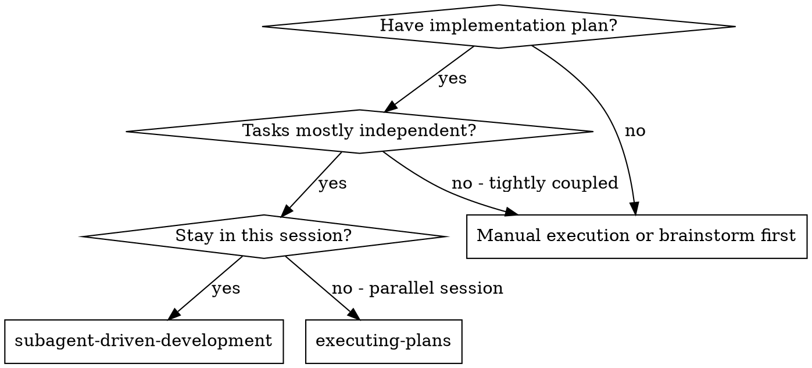

# Subagent-Driven Development

Execute an implementation plan with fresh implementers where isolation helps,
grouping small compatible tasks into meaningful work packages. Review a package
when its risk or independent ownership makes that useful, and review the whole
branch before a high-risk integration.

**Why subagents:** Delegate a bounded package with only the context it needs.
Prefer a fresh or bounded context; use the current harness's actual controls,
not an assumed universal fork API. OpenCode task sessions and Codex agent
threads have different dispatch and continuation mechanisms.

Context isolation does not imply filesystem isolation: children can share the
same checkout, index, generated files, and external state. The ownership and
snapshot rules below apply independently of whether the harness can run agents
concurrently. Read the active harness's `references/*-tools.md` for its tools.

**Core principle:** Match delegation and review checkpoints to the work's risk,
while keeping acceptance evidence tied to the current workstate.

Completion requires verified acceptance evidence and, when review was selected,
a clean review state. A Critical or Important acceptance gap remains blocking
until it is fixed or the controller records evidence that disproves the finding.
Bound repair attempts by the remaining risk and available strategies; a time
limit is not a correctness waiver.

**Narration:** keep updates concise — the current progress record and tool
results carry the durable record.

**Continuous execution:** Once execution is authorized, proceed through the
settled work packages without asking to repeat that authorization. Pause for
the safety and reliability conditions below, not for a ceremony checkpoint.

**Rulings, not stalls.** Ordinary implementation choices, conflicts, plan
defects, and review-loop limits you would have asked to exceed are decided,
not parked: a wrong ruling costs rework your human partner can see and undo,
while a session parked on a question costs their whole day and buys nothing.
Record material decisions or deviations in the current progress record as
`Ruling: <what you decided> — <why> — <what it costs if wrong>`, and keep
going. The spec-as-binding-authority contract is executing-plans' Rulings, Not
Stalls section; the entry router carries the same meta-rule.

Pause for: a missing authorization; a decision that would change the approved
product, architecture, scope, or security boundary; an as-yet unauthorized
irreversible or destructive operation; a security-sensitive action; a
cross-workspace external side effect (merge, push, publish, or platform upload)
that needs approval; and a plan so broken that every path forward is a guess.
Existing authorization within the same scope persists. Resolve repository facts
first. For a missing authorization, approved-decision change, or broken plan,
ask the smallest question that unlocks a reliable path, with a recommended
answer when one is available.

## When to Use



**vs. Executing Plans (parallel session):**
- Same session (no context switch)
- Fresh subagent per meaningful work package (no context pollution)
- Review at useful package boundaries, with a broad review when risk warrants it
- Faster iteration (no human-in-loop between tasks)

## The Process

```dot
digraph process {
    rankdir=LR;
    preflight [label="Load plan and check scope", shape=box];
    package [label="Group a meaningful work package", shape=box];
    implement [label="Implement and verify", shape=box];
    decision [label="Independent review useful?", shape=diamond];
    review [label="Review package and repair findings", shape=box];
    next [label="Next package or final verification", shape=box];
    preflight -> package -> implement -> decision;
    decision -> review [label="risk / ownership / integration"];
    decision -> next [label="self-check sufficient"];
    review -> next;
    next -> package [label="more work"];
    next -> final [label="complete"];
    final [label="Deliver; integrate only when authorized", shape=box];
}
```



## Setup

Ensure the work happens in an isolated workspace: use
superpowers:using-git-worktrees to create one or verify the existing one.
In plan-execution mode, isolation is a ruling, not a question — plan or goal
approval already granted it, so do not stop to ask for worktree consent.
Never start implementation on a main/master branch without your human
partner's explicit consent.

Conversation memory does not survive compaction. Reuse a reliable progress
record already kept by the plan or project rather than creating a duplicate
ledger. For substantial or multi-step work, a scoped ledger is useful; for a
small package, the plan checklist and verification record may be enough.

- When a scoped workspace is useful, run this skill's
  `scripts/sdd-workspace PLAN_FILE`; it prints the plan-specific ignored
  directory (`<repo-root>/.superpowers/sdd/<plan-basename>/`). Do not write
  another plan's workspace or scan it broadly; read a dependency artifact there
  only when the current plan or user explicitly names and authorizes that handoff.
- If that workspace has `<workspace>/progress.md` and its first line names the
  current plan, reuse its completed-task and ruling entries. A ledger whose
  first line names another plan — or a stray ledger at the old flat path
  `.superpowers/sdd/progress.md` — is not current progress.
- If you create a ledger, give it the identity first line:
  `# SDD ledger — plan: <plan file path>`. Keep material rulings, recovery
  state, and unresolved uncertainty there.
- Task briefs, reports, and review packages are optional handoff artifacts.
  Use the provided scripts and formats when one is chosen or when a selected
  review needs a durable diff/evidence file.
- `git clean -fdx` will destroy ignored scratch; if that happens, recover from
  git history and the surviving plan/project record.

Read the plan once, note its context and Global Constraints, and track the
work packages it defines. If the plan names a Spec, read that too: the spec is the
authority the plan argues from, and conflicts inside the plan resolve
against it. If a cited spec is missing, record the gap and resolve any affected
decision before dependent work. A plan explicitly based on confirmed direct
requirements needs no spec; use its recorded decision and authorization sources.

Before dispatching the first package, inspect the plan's self-review record and its
plan/spec/repository inputs. Reuse coverage and interface checks whose inputs
are unchanged; record the source in the plan's progress record when one is
maintained. Inspect changed or
unreviewed requirements, unresolved items and critical producer/consumer seams.
If no usable record exists, perform the coverage and interface check once.

Record material conflicts and their Rulings, with affected packages and evidence.
For a clean check, retain the checked scope and input workstate in a short
progress-record entry when durable recovery is useful; a row for every task or
task pair is unnecessary. A selected package or final review
can inspect implementation and catch conflicts that emerge there.

## Model Selection

Use the least powerful model that can handle each role; on this fork, resolve
roles to concrete model/effort routing via your harness's routing reference
(`references/*-tools.md`; Kimi Code exposes no model field, so routing is
omitted there). If a review package is selected, keep its implement-review
sequence coherent.

| Work | Tier |
|------|------|
| Mechanical: 1-2 files with a complete spec; plan text already contains the code (transcription plus testing) | cheapest |
| Integration: multi-file coordination, pattern matching, debugging | standard |
| Design judgment or broad codebase understanding; whole-branch review, when selected | most capable |
| Reviewers, scaled to the diff's size, complexity, and risk; implementers working from prose | mid-tier floor |
| Scoped re-reviews of small fix diffs | cheap-to-mid |

**Turn count beats token price.** The cheapest models routinely take 2-3× the
turns on multi-step work and often cost more overall.

**Specify the model explicitly only when your harness's dispatch schema
exposes a model field.** An omitted model inherits your session's model —
often the most capable and most expensive — which silently defeats this
section; but never require a field the active schema lacks. When repeated
repair attempts do not change the result, use a fresh perspective or a more
capable model rather than repeating the same dispatch.

## The Task Loop

**Batch small same-shape work.** When the plan lists several tasks that are
each a small, independent edit of the same kind — the same one-line fix,
constant change, or field addition repeated across files — do not dispatch one
subagent per tiny task. Compose ONE dispatch brief listing every file and
its change, send the whole batch to a single subagent, and review its diff
as one unit. Reserve one-dispatch-per-package for work that needs its own
judgment, its own tests, or its own review surface.

Everything you paste into a dispatch prompt — and everything a subagent
prints back — stays resident in your context for the rest of the session
and is re-read on every later turn. Hand artifacts over as files.

**Waiting on dispatched subagents:** never poll a wait interface with
short timeouts, and never sit in one silent, open-ended wait either.
While you have local work — ledger updates, packaging the next review,
reading reports — keep working; child results arrive on their own.
When you are genuinely idle, wait in bounded stretches (five to ten
minutes, where your platform allows), and between stretches post one
line of status and reconcile your live children: list them, and chase
any that finished without reporting. A bounded stretch keeps nearly
all of a long wait's efficiency while guaranteeing a stuck or lost
child is noticed within minutes, not at the end of the session.

### 1. Dispatch the implementer

For a package selected for committed review, record BASE (`git rev-parse HEAD`)
before dispatching. For a dirty or concurrently developed package, record the
current status and the exact owned path set instead; a `BASE..HEAD` range does
not represent uncommitted changes.
For each dirty review snapshot, include the owned paths' status, staged and
unstaged diffs, and new-file contents (or an equivalent complete snapshot).
Reconcile against the pre-dispatch state so existing user edits are not
misattributed to this package. The dirty-snapshot references below use this scope.

- **Task brief:** when a package needs a durable context handoff, run this
  skill's `scripts/task-brief PLAN_FILE N` — it extracts the selected task's
  text to a uniquely named file and prints the path. Otherwise pass the exact
  relevant plan section directly. A dispatch should contain: (1) where the
  package fits in the project; (2) the requirements and interfaces it owns;
  (3) decisions from earlier work that the brief cannot know; (4) a ruling for
  any ordinary ambiguity; and (5) focused commands or observations supporting
  the acceptance claim. Include exact values only where the public contract or
  settled design requires them. Never make a subagent read the whole plan
  file.
- **Report file:** an implementer report is optional. When one is useful,
  name it after the brief (brief `…/task-N-brief.md` → report
  `…/task-N-report.md`) and put the report contract in the dispatch prompt.
  Otherwise the implementer returns status, work-state identifier, evidence,
  and concerns in its response.
- A dispatch prompt describes one task, not the session's history. Do not
  paste accumulated prior-task summaries ("state after Tasks 1-3") into
  later dispatches — a real session's dispatch hit 42k chars of which 99%
  was pasted history. A fresh subagent needs its task, the interfaces it
  touches, and the global constraints. Nothing else.
- The dispatch carries the no-subagents contract (it is in the
  implementer template): the implementer never dispatches subagents —
  not helpers, and never a reviewer. The controller owns review selection
  and dispatch; when selected, review follows the implementer's response or
  report. Uncoordinated review seats can duplicate that work.
- If earlier work deferred a Minor or recorded a finding-exclusion ruling in
  the area this package touches, carry a pointer to that progress-record entry
  in the dispatch.
- Record the implementer's agent identity when resumption would preserve useful
  context; a fresh implementer is equally valid when a different perspective
  or clean context is safer.
- Parallel implementation is safe only for genuinely independent packages
  with explicit ownership, disjoint write sets, no shared generated state, and
  separately attributable status/diffs (prefer separate worktrees). Keep
  dependent packages and shared files serial. Before integration, reconcile
  each package's path-scoped diff. For a committed linear package use the
  recorded `BASE..HEAD` review range; for dirty work provide a path-scoped
  status/diff artifact. Never use a commit range to imply uncommitted changes.

Template: [implementer-prompt.md](implementer-prompt.md)

### 2. Handle the report

Implementer subagents report one of four statuses. Handle each appropriately:

**DONE:** If this package was selected for independent review, prepare its
committed range or dirty snapshot as described in §3, then dispatch the reviewer.
Otherwise inspect the diff and run the package's focused verification.

**DONE_WITH_CONCERNS:** The implementer completed the work but flagged doubts.
Read the concerns before proceeding. If they are about correctness or scope,
address them before the selected review or acceptance check. If they are
observations (for example, file size), note them and continue with the chosen
verification.

**NEEDS_CONTEXT:** The implementer needs information that wasn't provided. Provide the missing context and re-dispatch.

**BLOCKED:** The implementer cannot complete the task. Assess the blocker:
1. If it's a context problem, provide more context and re-dispatch with the same model
2. If the task requires more reasoning, re-dispatch with a more capable model
3. If the task is too large, break it into smaller pieces
4. If the plan itself is wrong, record the correction in the progress record
   and re-dispatch with the ruling carried in the dispatch

**Never** ignore an escalation or force the same model to retry without changes. If the implementer said it's stuck, something needs to change.

If the implementer asks questions — before starting or mid-task — answer
clearly and completely, provide additional context if needed, and don't
rush it into implementation.

Before accepting any DONE status, the controller owns the acceptance check.
Tie each claim to the revision or identified dirty snapshot under review, inspect the retained raw
command output and exit code, locate the produced artifact, and map the
evidence to the stated criterion. A short success summary is not evidence.
When the evidence is complete and still valid for the current workstate,
consume it without mechanically rerunning the whole suite. If it is missing,
stale, or raises a concrete question, run only the smallest focused check that
resolves that gap.

### 3. Review a meaningful work package

Use a task-scoped review when the package has a public, security, data,
architectural, cross-owner, or otherwise judgment-heavy surface. Group small
compatible plan tasks into one package. For a tiny low-risk mechanical package,
a self-review and focused check are sufficient; policy text may change behavior
or permissions and is not automatically low risk.
The broad review remains available for the whole branch when its risk warrants
it. A review report should still separate requirement coverage from quality
when a reviewer is dispatched.

- When review is selected, provide a scoped diff/status artifact. For a
  committed package, run this skill's `scripts/review-package PLAN_FILE BASE
  HEAD` and pass the printed path (or, without bash, `git log --oneline`, `git
  diff --stat`, and `git diff -U10` for the recorded range). For dirty work,
  provide an equivalent path-scoped status and diff that names the owned files;
  do not let a commit range stand in for those changes. The reviewer should
  see the relevant commits, stat summary, and full diff with context in one
  read. Use the BASE recorded before dispatching — never `HEAD~1`, which can
  silently truncate a multi-commit package.
- **Reviewer inputs:** provide the selected brief/report paths, if any, the
  scoped diff/status artifact, and the global constraints that bind the
  package. Do not manufacture artifacts solely to satisfy this template.
- The global-constraints block you hand the reviewer is its attention
  lens. Copy the binding requirements verbatim from the plan's Global
  Constraints section or the spec: exact values, exact formats, and the
  stated relationships between components ("same layout as X", "matches
  Y"). The reviewer's template already carries the process rules (YAGNI,
  test hygiene, review method) — the constraints block is for what THIS
  project's spec demands.
- Do not add open-ended directives like "check all uses" or "run race tests
  if useful" without a concrete, task-specific reason
- Do not mechanically ask a reviewer to re-run tests already run on the same
  code. The reviewer may inspect the smallest relevant unchanged call site or
  configuration and run a targeted check when a concrete risk or evidence gap
  warrants it; record the reason and result.
- Do not pre-judge findings for the reviewer — never instruct a reviewer to
  ignore or not flag a specific issue. If you believe a finding would be a
  false positive, let the reviewer raise it and adjudicate it in the review
  loop. If the prompt you are writing contains "do not flag," "don't treat X
  as a defect," "at most Minor," or "the plan chose" — stop: you are
  pre-judging, usually to spare yourself a review loop.
The task reviewer may report "⚠️ Cannot verify from diff" items — requirements
that live in unchanged code or span packages. The controller may resolve one
with the smallest relevant context read or focused check rather than a broad
crawl. If you confirm an item is a real gap, treat it as a failed spec review —
it enters the fix loop with the other findings.

Template: [task-reviewer-prompt.md](task-reviewer-prompt.md)

### 4. The fix loop

The loop triggers when the review reports spec ❌, any Critical or Important
finding, or a ⚠️ item you confirmed as a real gap.

Before the loop starts, two routes leave it immediately:

- Record Minor findings in the plan's progress record as you go (using a ledger
  when one exists: `Task <N>: minor (deferred): <one-liner>`), and point the final
  whole-branch review at that list so it can triage which must be fixed
  before merge. If no final review is selected, the controller triages the list
  before delivery or integration and reports any retained deferrals. Minor findings
  never enter the loop.
- A finding labeled plan-mandated — or any finding that conflicts with
  what the plan's text requires — is yours to rule on: weigh the finding
  against the plan text, decide with the spec as the binding authority, and
  record the ruling before you act on it. Do not dismiss the finding because
  the plan mandates it, and do not dispatch a fix that contradicts the plan
  without a recorded ruling.
Everything else enters the repair cycle. A cycle is one repair dispatch (or a
small, well-understood controller correction) plus the focused verification and
re-review appropriate to the changed risk. Continue while a real
Critical/Important gap remains and an authorized, feasible repair path exists;
there is no fixed round or retry count.

Resume the implementer when its context is useful; use a fresh implementer
when the task needs a different perspective or the original context is stale.
A controller may make a trivial, well-understood correction directly when the
focused check remains valid. Every substantive fix must rerun the checks that
cover the amended code and preserve the current-workstate-bound report evidence.

**A re-review is scoped.** Compare the fix to the workstate the previous review
saw. For committed fixes use `scripts/review-package PLAN_FILE FIX_BASE HEAD`;
for dirty fixes use the complete snapshot defined in §1 plus an attributable
delta from the reviewed snapshot. Dispatch
[re-review-prompt.md](re-review-prompt.md) with the findings, assigned requirements,
available evidence, and this fix scope. The re-reviewer verdicts
each finding ADDRESSED or NOT ADDRESSED and flags new breakage in the fix
diff only. New Critical/Important breakage in the fix diff joins the open
findings list. Out-of-scope observations go to the progress record or
controller for final triage with their original severity; they are not silently
converted to Minor or added to the current fix loop. An isolated typo, wording,
or low-risk documentation fix needs only its focused check.

**After each cycle,** append to the progress record (a ledger when one is
used):
`Task <N>: fix cycle <R> (<X> addressed, <Y> open — <finding one-liners>; work-state <identifier>)`

If repeated attempts do not change the result, change strategy or re-decompose
instead of repeating the same dispatch. If no authorized feasible path remains,
record the work as incomplete and report the gap honestly.

When evidence disproves a finding, record
`Task <N>: Ruling: finding excluded — <evidence and why>` and close it; if the
evidence shows the strategy cannot work, change strategy. A real
Critical/Important acceptance gap remains open and blocking: record a
meaningfully changed, testable fix strategy or re-decompose, then continue an
authorized feasible repair — renaming the same approach is not a new strategy.
If no reliable path exists, record `Task <N>: incomplete — <gap and evidence>`
and report it.

Every material ruling must be in the current progress record with its evidence,
or in the report/controller handoff when no durable record exists.

### 5. Complete the work package

When the selected review is clean, or when self-review is sufficient, and the
controller has verified current-workstate-bound acceptance evidence, append the
completion line to the progress record when one is maintained. A finding excluded by an evidence-backed ruling
is no longer open; deferred Minors go to final review or controller triage.

- `Task <N>: complete (work-state <identifier>, reviewed or self-checked)`
- `Task <N>: complete (work-state <identifier>, <K> findings excluded,
  <M> Minors deferred)` when no real Critical/Important gap remains. Include a
  commit range when one exists; a dirty package records its path-scoped status
  and diff instead.

Then mark the package complete and move on. Do not integrate a dependent
package while the selected review has an open real Critical/Important issue.
Independently owned packages with disjoint writes may proceed in parallel, but
their status and diffs stay separately attributable until the finding is
resolved. If a changed strategy or re-decomposition leaves an authorized
feasible repair, continue it instead; only an explicitly recorded incomplete
task may leave that gap unresolved.

## Final Review

When the branch has substantial or high-risk changes, request a whole-branch
review. For a committed branch, run `scripts/review-package PLAN_FILE
MERGE_BASE HEAD` (MERGE_BASE = the commit the branch started from, e.g. `git
merge-base main HEAD`) and include the printed path in the review dispatch. For
dirty work, provide an equivalent path-scoped status and diff. The reviewer
reads one artifact instead of re-deriving the branch diff with git commands.
Dispatch
on a model with enough judgment for the change (see Model Selection), using
superpowers:requesting-code-review's
[code-reviewer.md](../requesting-code-review/code-reviewer.md). Point it at
the progress record's deferred-Minor and finding-exclusion ruling lines when
they exist so it can triage
which must be fixed before merge.

Before calling the branch merge-ready, the controller performs the same
current-workstate evidence check (per "Handle the report") against the final
revision or dirty snapshot.

If the final whole-branch review returns findings, group related findings into
repair packages by ownership and dependency — not one fixer per finding — and
review each changed surface at the appropriate scope. Re-run the checks that
cover each amended area. Continue repairing and re-reviewing while a real
Critical/Important finding remains and an authorized feasible strategy exists.
If the same strategy does not
change the result, change strategy or re-decompose. Do not auto-pass residual
findings. If no reliable path exists, report the branch incomplete and keep it
out of merge-ready status.

## Finish

Before archiving anything, retain material rulings, unresolved uncertainty, and
their evidence in the ledger or report. The final message may link that durable
record instead of copying every ordinary implementation choice; surface the
decisions that affect scope, safety, or acceptance and what would cost if wrong.

After verification and any selected final review, retain the plan workspace.
When the project or user requests cleanup, it may move to an explicitly named,
timestamped archive under `~/scratch/`. Preserve the ledger, review packages,
reports, and raw verification evidence; do not use recursive deletion.

When integration or cleanup is requested, use superpowers:finishing-a-development-branch
and honor the existing authorized choice. Otherwise report the verified result
and retained branch/workspace without opening an integration menu.

## Common Rationalizations

| Excuse | Reality |
|--------|---------|
| "Close enough on spec compliance" | A real Critical/Important gap needs a repair or an explicit incomplete report; an iteration limit is not a waiver. |
| "I'll fix it myself, dispatching is overhead" | A substantive fix needs a suitable review path; a trivial, well-understood correction can be handled directly with focused evidence. |
| "One more round will converge" | If the same approach is not changing the result, change strategy or re-decompose. |
| "The reviewer will just find something new anyway" | Scoped re-reviews verify fixes; they cannot wander. New findings on untouched code go to the ledger, not the loop. |
| "This finding is obviously wrong, I'll drop it" | Use concrete evidence and record a ruling that excludes it; silent discards and auto-passes are forbidden. |
| "The fix was small, skip the check" | Match the follow-up to the changed risk: a substantive fix gets a scoped review; an isolated wording or typo fix gets a focused check. |
| "Reviews slow the loop down" | The loop without reviews is just unverified churn. Reviews are the loop's brakes and steering. |
| "A progress record is overhead" | Reuse the plan or project record when it is reliable; for substantial work, a durable record prevents compaction from re-dispatching completed packages. Do not create duplicate ledgers for ceremony. |
| "The final repair pass was enough" | A residual real Critical/Important finding keeps the branch out of merge-ready status; change strategy or re-decompose for another feasible repair, or report incomplete. |
| "The implementer spawned its own reviewer — free extra assurance" | It may duplicate a selected package review; keep the review surface explicit and useful rather than adding seats by default. |

## Example Workflow

```
You: I'm using Subagent-Driven Development to execute this plan.

[Read plan; use sdd-workspace and helper artifacts when they improve handoff; track packages]

Per work package:
1. When useful, task-brief <plan-file> N  →  dispatch an implementer for a meaningful package
2. Implementer implements, tests, and self-reviews; raises only authorization or material decision blockers
3. If review is warranted, review-package <plan-file> BASE HEAD (or a dirty path-scoped artifact)  →  dispatch a reviewer
4. Critical/Important findings → repair and re-review when the risk surface changes; Minor → progress record for final review or controller triage
5. Progress record: the package is complete only after current-workstate evidence verifies acceptance

After substantial or high-risk work: whole-branch review when warranted → deliver evidence and retained workspace;
requested integration/cleanup → finishing-a-development-branch with existing authorization.
```
