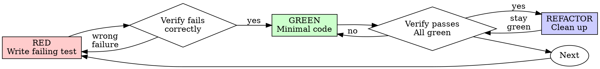

# Test-Driven Development (TDD)

## Outcome

For a production behavior change, establish that the test can detect the
missing behavior before implementing it:

1. RED — add one focused behavior test and run it.
2. Confirm the expected failure is caused by the missing behavior.
3. GREEN — write the minimal implementation and run the owning test.
4. REFACTOR — if cleanup is needed, improve structure while the owning suite
   stays green.

The RED observation is the evidence that the new test distinguishes the old
behavior from the requested behavior. If implementation already exists, use an
isolated baseline (such as a prior revision or separate worktree) or a safe,
targeted mutation to establish that evidence without overwriting shared or
user-modified work.

For a behavior-preserving refactor, compare the existing checks on the current
baseline and on the candidate instead of inventing a failing test. This is
baseline/candidate evidence, not RED evidence, and should not be described as
test-first. Classify configuration changes by impact: configuration that
changes an observable behavior follows the behavior-change cycle; metadata,
formatting, or documentation-only configuration uses the relevant parser,
lint, build, or review check without a synthetic RED step.

## Scope

Use this cycle for new features, bug fixes, and behavior-changing refactors
after the workflow router selects TDD. For a refactor intended to preserve
behavior, use the baseline/candidate path described above. Classify
configuration by observable impact rather than by file extension: runtime
behavior changes need behavioral evidence, while metadata, formatting, and
documentation-only changes use an appropriate direct check. Route throwaway
prototypes, generated code, and missing test infrastructure before invoking
this Skill. Contracts carried in natural language (agent-facing docstrings,
prompts, system messages) do not run a RED-GREEN cycle per phrase: review their
scientific and routing semantics first, then test their load-bearing structure
(schema fields, routing tokens, stable parameters), grouping checks by the
contract they protect rather than adding containment checks per prose fragment. Once
selected, complete the appropriate evidence cycle for each changed behavior.

## Red-Green-Refactor

The diagram shows the full cycle for a behavior change that also needs
structural cleanup. If no cleanup is needed, finish after GREEN and the
owning-suite verification; do not manufacture a REFACTOR step.



### RED - Write Failing Test

Write one minimal test showing what should happen. Use the real implementation
where practical and only with authorized, controlled side effects; a bounded
offline fake, stub, or other double is appropriate when a dependency is
external, unavailable, slow, nondeterministic, or costly to run, as long as
assertions still target the owning behavior rather than the double's existence.

<Good>
```typescript
test('returns success on the third attempt after two failures', async () => {
  let attempts = 0;
  const operation = async () => {
    attempts++;
    if (attempts < 3) throw new Error('fail');
    return 'success';
  };

  const result = await retryOperation(operation);

  expect(result).toBe('success');
  expect(attempts).toBe(3);
});
```
Clear name, tests real behavior, one thing
</Good>

<Bad>
```typescript
test('retry works', async () => {
  const mock = jest.fn()
    .mockRejectedValueOnce(new Error())
    .mockRejectedValueOnce(new Error())
    .mockResolvedValueOnce('success');
  await retryOperation(mock);
  expect(mock).toHaveBeenCalledTimes(3);
});
```
Vague name and incomplete outcome coverage: the call count can verify the
retry interaction, but this test would still pass if the successful result
were discarded. Add a result assertion; using a mock is not itself the defect.
</Bad>

**Requirements:**
- One behavior: one reason for failure, not one file, function, assertion, or test
- Clear name
- Observable behavior, using real code or a faithful, purpose-built double
  when the dependency cannot reasonably run in this test

### Verify RED - Watch It Fail

For a behavior change, do not skip this evidence.

Run the focused test against the baseline behavior:

```bash
npm test path/to/test.test.ts
```

Confirm that the result is caused by the requested behavior being absent and
that the expectation is independently derived. A runner failure and a runner
error are not classified by their label alone: an error can be valid RED when
it is the direct, expected symptom of the missing behavior, while a setup,
syntax, or dependency error is not. Repair unrelated setup problems and rerun
until the result isolates the missing behavior.

If the test passes, refine it so it distinguishes the requested behavior, or
establish the baseline with an isolated fixture, prior revision, or safe
targeted mutation. Do not overwrite shared or user-modified work to obtain it.
If a historical test was only run after the implementation already existed,
record it as current-state/GREEN evidence; do not relabel that run as
test-first RED.

### GREEN - Minimal Code

Write simplest code to pass the test.

<Good>
```typescript
async function retryOperation<T>(fn: () => Promise<T>): Promise<T> {
  for (let i = 0; i < 3; i++) {
    try {
      return await fn();
    } catch (e) {
      if (i === 2) throw e;
    }
  }
  throw new Error('unreachable');
}
```
Just enough to pass
</Good>

<Bad>
```typescript
async function retryOperation<T>(
  fn: () => Promise<T>,
  options?: {
    maxRetries?: number;
    backoff?: 'linear' | 'exponential';
    onRetry?: (attempt: number) => void;
  }
): Promise<T> {
  // YAGNI
}
```
Over-engineered
</Bad>

Keep the implementation surface limited to the behavior demonstrated by the
test.

### Verify GREEN - Watch It Pass

For a behavior change, rerun the focused check after implementation.

Run the focused test again after the minimal implementation:

```bash
npm test path/to/test.test.ts
```

Confirm:
- Test passes
- Other tests still pass
- No unexplained relevant errors or newly introduced warnings. Pre-existing
  warnings from third-party tools do not by themselves expand the task; note
  them when they affect interpretation.

When the focused test fails, adjust the implementation until it satisfies the
behavior contract. When another test fails, treat it as regression evidence and
resolve it before refactoring.

### REFACTOR - Clean Up

After green only:
- Remove duplication
- Improve names
- Extract helpers
- Extend an existing table or nearby suite before creating a test file
- Split a suite by contract subdomain when it outgrows a maintainable size,
  instead of letting one topic owner grow without bound
- Merge cases that exercise the same behavior through the same setup when a
  table-driven form improves clarity and maintenance; keep case intent visible
  and do not impose a fixed case-count threshold
- Delete tautologies, exact-source-text checks, and coverage-only assertions
- Keep characterization tests only for behavior the project relies on
- Move reusable setup into test utilities, never test-only production APIs

Keep tests green and behavior stable. Remove a redundant test when the
remaining suite covers the same contract and its failure mode remains clear.
Targeted mutation reasoning or checks can support that decision, but routine
cleanup does not require exhaustive mutation proof.

### Repeat

Next failing test for next feature.

## Good Tests

| Quality | Good | Bad |
|---------|------|-----|
| **Minimal** | One reason to fail | Unrelated behaviors in one test |
| **Clear** | Name describes behavior | `test('test1')` |
| **Shows intent** | Demonstrates desired API | Obscures what code should do |

## Evidence Produced by the Order

Each phase contributes a distinct, observable record:

| Phase | Evidence | What it establishes |
|-------|----------|---------------------|
| RED | Focused test command, expected failure, and output | The test detects the missing behavior |
| GREEN | Same focused command passing after the minimal implementation | The implementation supplies the requested behavior |
| REFACTOR (if needed) | Owning suite passing after structural cleanup | Structure changed without changing behavior |
| BASELINE/CANDIDATE | Existing checks on the unchanged baseline and candidate | A behavior-preserving refactor or non-behavior configuration change kept its contract |

A test first run after implementation supplies GREEN evidence but no RED
evidence. Manual checks can help exploration, while an automated RED record
supplies the repeatable baseline needed for regression protection. If code
exists before that baseline is captured, use an isolated prior revision,
separate worktree, or safe targeted mutation to establish RED, then restore the
candidate and record GREEN without overwriting shared or user-modified work.
For behavior-preserving refactors, the existing suite run before and after the
change is the relevant current-state verification; do not create an artificial
failure merely to fill the RED column.

## Example: Bug Fix

**Bug:** Empty email accepted

**RED**
```typescript
test('rejects empty email', async () => {
  const result = await submitForm({ email: '' });
  expect(result.error).toBe('Email required');
});
```

**Verify RED**
```bash
$ npm test
FAIL: expected 'Email required', got undefined
```

**GREEN**
```typescript
function submitForm(data: FormData) {
  if (!data.email?.trim()) {
    return { error: 'Email required' };
  }
  // ...
}
```

**Verify GREEN**
```bash
$ npm test
PASS
```

**REFACTOR**
Extract validation for multiple fields if needed.

## Verification Checklist

Before reporting the selected evidence path complete, collect the applicable
items:

- [ ] Every behavior-changing implementation has a focused test that was
      observed against the pre-change baseline and detects the missing behavior
- [ ] Every behavior-preserving refactor has baseline and candidate results from
      the relevant existing checks; no artificial RED test was added
- [ ] Configuration changes are classified by observable impact and have the
      corresponding behavioral or direct validation
- [ ] Each test names the production break it catches
- [ ] New helpers are covered through the nearest stable public boundary unless they independently validate, normalize, default, derive, or cause side effects
- [ ] (Behavior change) RED output records the expected failure before
      implementation
- [ ] (Behavior change) GREEN output records the focused test passing after the
      minimal implementation
- [ ] The owning suite passes after any REFACTOR cleanup, or the candidate
      verification is recorded when no cleanup was needed
- [ ] Verification output has no unexplained relevant errors or new warnings;
      material pre-existing third-party warnings are distinguished
- [ ] Tests exercise the owning behavior with real code or a justified offline
      double
- [ ] Edge cases and errors covered where the contract calls for them

Apply the checklist items for the selected path. An inapplicable phase is not
an evidence gap; missing evidence for an applicable behavior is.

## When Stuck

| Problem | Solution |
|---------|----------|
| Don't know how to test | Write wished-for API. Write assertion first. Ask your human partner. |
| Test too complicated | Design too complicated. Simplify interface. |
| Must mock everything | Code too coupled. Use dependency injection. |
| Test setup huge | Extract helpers. Still complex? Simplify design. |

## Debugging Integration

For a bug, write a focused test that reproduces the symptom and record RED.
Follow the cycle so the same test records GREEN and protects the behavior from
regression.

## Writing Good Tests

When writing or reorganizing tests, read
[writing-good-tests.md](writing-good-tests.md). Every test should name the
break it catches and exercise real behavior at the narrowest stable boundary.

## Completion Contract

A behavior-changing implementation has TDD evidence when the record contains:

```
RED: focused test fails for the missing behavior
GREEN: the same test passes after the minimal implementation
REFACTOR (if cleanup is needed): the owning suite remains green after cleanup
```

Report the commands and outcomes that establish each phase.

For a behavior-preserving refactor or non-behavior configuration change, report
the relevant baseline and candidate checks instead. A historical test run made
after implementation is useful current-state evidence, but it is not RED
evidence and should not be presented as test-first.

**Test cleanup is part of completion.** Temporary or scaffolding tests created
during development (probes, throwaway fixtures, debugging-only cases) must be
removed or folded into the owning regression suite before the change is
complete. Keep contract tests and genuine regression tests; delete or
consolidate tests that only served development iteration. A completed change
does not carry scaffolding tests forward.
