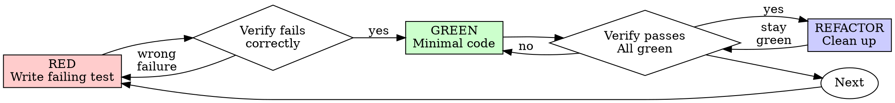

# Test-Driven Development (TDD)

## Outcome

For a production behavior change, establish that the test can detect the
missing behavior before implementing it:

1. RED — add one focused behavior test and run it.
2. Confirm the expected failure is caused by the missing behavior.
3. GREEN — write the minimal implementation and run the owning test.
4. REFACTOR — improve structure while the owning suite stays green.

The RED observation is the evidence that the new test distinguishes the old
behavior from the requested behavior. If implementation already exists, use a
temporary revert or an equivalent isolated baseline to establish that evidence.

## Scope

Use this cycle for new features, bug fixes, refactoring, and behavior changes
after the workflow router selects TDD. Route throwaway prototypes, generated
code, configuration-only edits, and missing test infrastructure before invoking
this Skill. Once selected, complete the evidence cycle for each changed
behavior.

## Red-Green-Refactor



### RED - Write Failing Test

Write one minimal test showing what should happen.

<Good>
```typescript
test('retries failed operations 3 times', async () => {
  let attempts = 0;
  const operation = () => {
    attempts++;
    if (attempts < 3) throw new Error('fail');
    return 'success';
  };

  const result = await retryOperation(operation);

  expect(result).toBe('success');
  expect(attempts).toBe(3);
});
```
Clear name, tests real behavior, one thing
</Good>

<Bad>
```typescript
test('retry works', async () => {
  const mock = jest.fn()
    .mockRejectedValueOnce(new Error())
    .mockRejectedValueOnce(new Error())
    .mockResolvedValueOnce('success');
  await retryOperation(mock);
  expect(mock).toHaveBeenCalledTimes(3);
});
```
Vague name, tests mock not code
</Bad>

**Requirements:**
- One behavior: one reason for failure, not one file, function, assertion, or test
- Clear name
- Real code (no mocks unless unavoidable)

### Verify RED - Watch It Fail

**MANDATORY. Never skip.**

Run the focused test against the baseline behavior:

```bash
npm test path/to/test.test.ts
```

Confirm:
- Test fails (not errors)
- Failure message is expected
- Fails because feature missing (not typos)

If the test passes, refine it so it distinguishes the requested behavior, or
establish the baseline with a temporary revert or equivalent isolated fixture.
If the test errors, correct the test setup and rerun until it produces the
expected failure.

### GREEN - Minimal Code

Write simplest code to pass the test.

<Good>
```typescript
async function retryOperation<T>(fn: () => Promise<T>): Promise<T> {
  for (let i = 0; i < 3; i++) {
    try {
      return await fn();
    } catch (e) {
      if (i === 2) throw e;
    }
  }
  throw new Error('unreachable');
}
```
Just enough to pass
</Good>

<Bad>
```typescript
async function retryOperation<T>(
  fn: () => Promise<T>,
  options?: {
    maxRetries?: number;
    backoff?: 'linear' | 'exponential';
    onRetry?: (attempt: number) => void;
  }
): Promise<T> {
  // YAGNI
}
```
Over-engineered
</Bad>

Keep the implementation surface limited to the behavior demonstrated by the
test.

### Verify GREEN - Watch It Pass

**MANDATORY.**

Run the focused test again after the minimal implementation:

```bash
npm test path/to/test.test.ts
```

Confirm:
- Test passes
- Other tests still pass
- Output pristine (no errors, warnings)

When the focused test fails, adjust the implementation until it satisfies the
behavior contract. When another test fails, treat it as regression evidence and
resolve it before refactoring.

### REFACTOR - Clean Up

After green only:
- Remove duplication
- Improve names
- Extract helpers
- Extend an existing table or nearby suite before creating a test file
- Split a suite by contract subdomain when it outgrows a maintainable size,
  instead of letting one topic owner grow without bound
- Merge cases that exercise the same behavior through the same setup
- Delete tautologies, exact-source-text checks, and coverage-only assertions
- Keep characterization tests only for behavior the project relies on
- Move reusable setup into test utilities, never test-only production APIs

Keep tests green and behavior stable. Remove a redundant test only when the
remaining suite catches the same realistic production mutations.

### Repeat

Next failing test for next feature.

## Good Tests

| Quality | Good | Bad |
|---------|------|-----|
| **Minimal** | One reason to fail | Unrelated behaviors in one test |
| **Clear** | Name describes behavior | `test('test1')` |
| **Shows intent** | Demonstrates desired API | Obscures what code should do |

## Evidence Produced by the Order

Each phase contributes a distinct, observable record:

| Phase | Evidence | What it establishes |
|-------|----------|---------------------|
| RED | Focused test command, expected failure, and output | The test detects the missing behavior |
| GREEN | Same focused command passing after the minimal implementation | The implementation supplies the requested behavior |
| REFACTOR | Owning suite passing after structural cleanup | Structure changed without changing behavior |

A test first run after implementation supplies GREEN evidence but no RED
evidence. Manual checks can help exploration, while an automated RED record
supplies the repeatable baseline needed for regression protection. If code
exists before that baseline is captured, use a temporary revert or equivalent
isolated baseline, record RED, restore the implementation, and record GREEN.

## Example: Bug Fix

**Bug:** Empty email accepted

**RED**
```typescript
test('rejects empty email', async () => {
  const result = await submitForm({ email: '' });
  expect(result.error).toBe('Email required');
});
```

**Verify RED**
```bash
$ npm test
FAIL: expected 'Email required', got undefined
```

**GREEN**
```typescript
function submitForm(data: FormData) {
  if (!data.email?.trim()) {
    return { error: 'Email required' };
  }
  // ...
}
```

**Verify GREEN**
```bash
$ npm test
PASS
```

**REFACTOR**
Extract validation for multiple fields if needed.

## Verification Checklist

Before reporting the behavior cycle complete, collect:

- [ ] Every changed observable behavior is protected by a test that failed first
- [ ] Each test names the production break it catches
- [ ] New helpers are covered through the nearest stable public boundary unless they independently validate, normalize, default, derive, or cause side effects
- [ ] RED output records the expected failure before implementation
- [ ] GREEN output records the focused test passing after the minimal implementation
- [ ] The owning suite passes after REFACTOR
- [ ] Verification output is free of errors and warnings
- [ ] Tests use real code (mocks only if unavoidable)
- [ ] Edge cases and errors covered

Any missing item is an evidence gap. Establish that evidence before making the
corresponding completion claim.

## When Stuck

| Problem | Solution |
|---------|----------|
| Don't know how to test | Write wished-for API. Write assertion first. Ask your human partner. |
| Test too complicated | Design too complicated. Simplify interface. |
| Must mock everything | Code too coupled. Use dependency injection. |
| Test setup huge | Extract helpers. Still complex? Simplify design. |

## Debugging Integration

For a bug, write a focused test that reproduces the symptom and record RED.
Follow the cycle so the same test records GREEN and protects the behavior from
regression.

## Writing Good Tests

When writing or reorganizing tests, read
[writing-good-tests.md](writing-good-tests.md). Every test should name the
break it catches and exercise real behavior at the narrowest stable boundary.

## Completion Contract

A behavior change has TDD evidence when the record contains:

```
RED: focused test fails for the missing behavior
GREEN: the same test passes after the minimal implementation
REFACTOR: the owning suite remains green after cleanup
```

Report the commands and outcomes that establish each phase.
